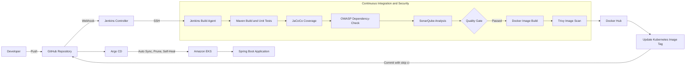
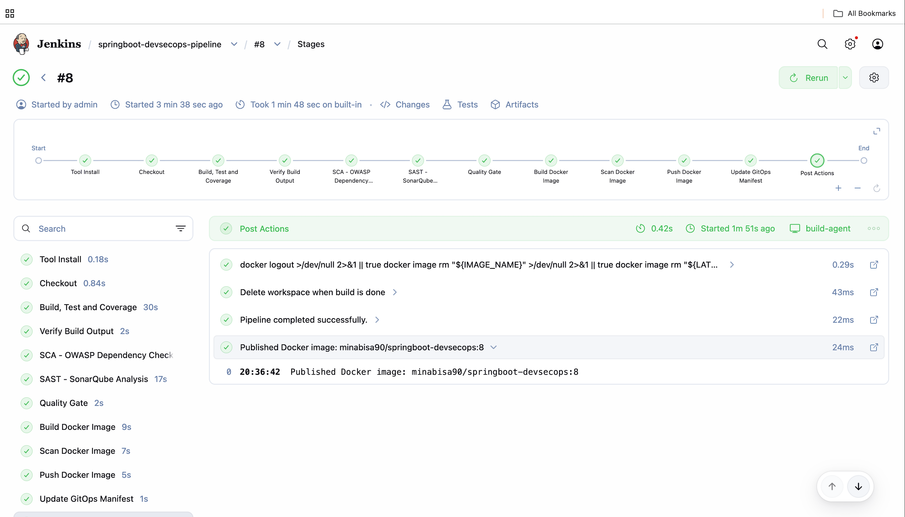
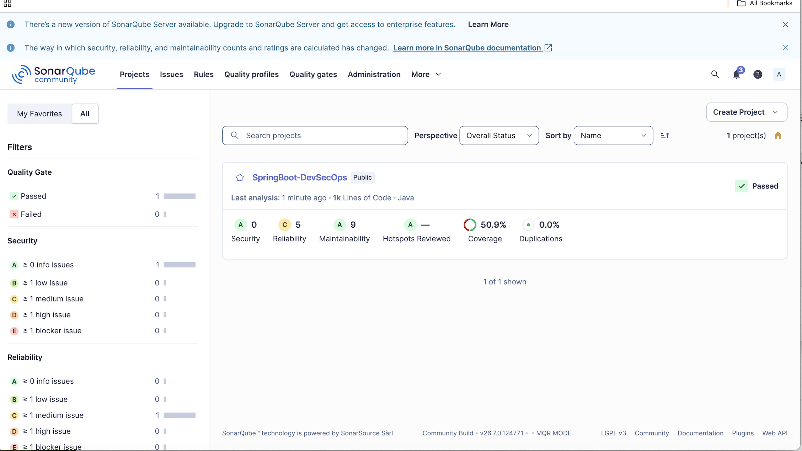
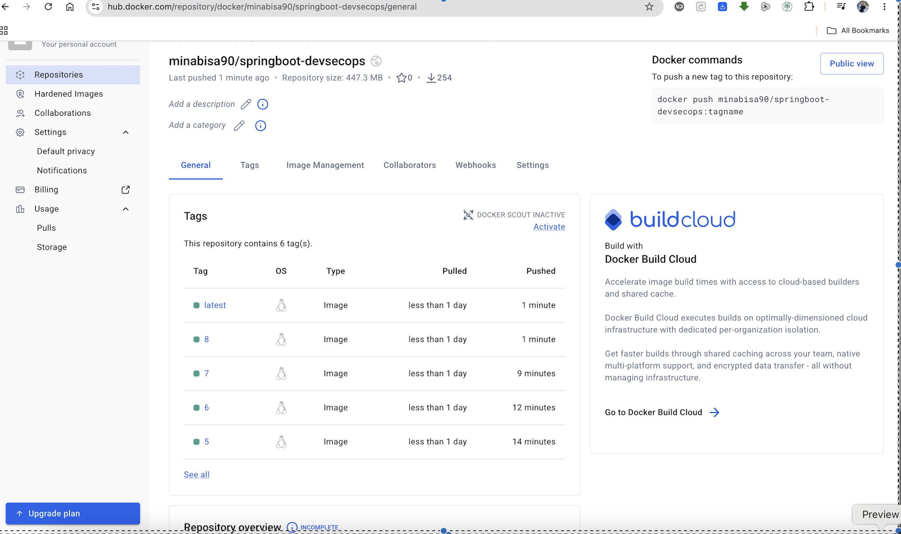
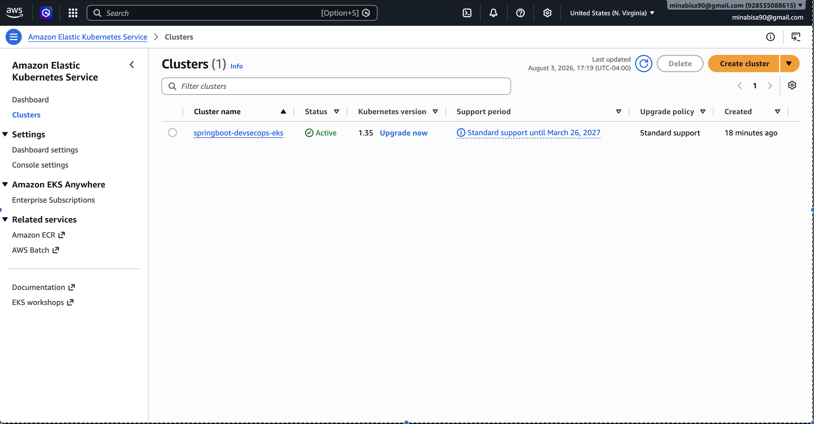
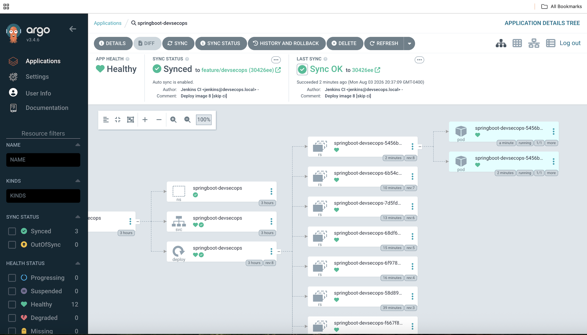
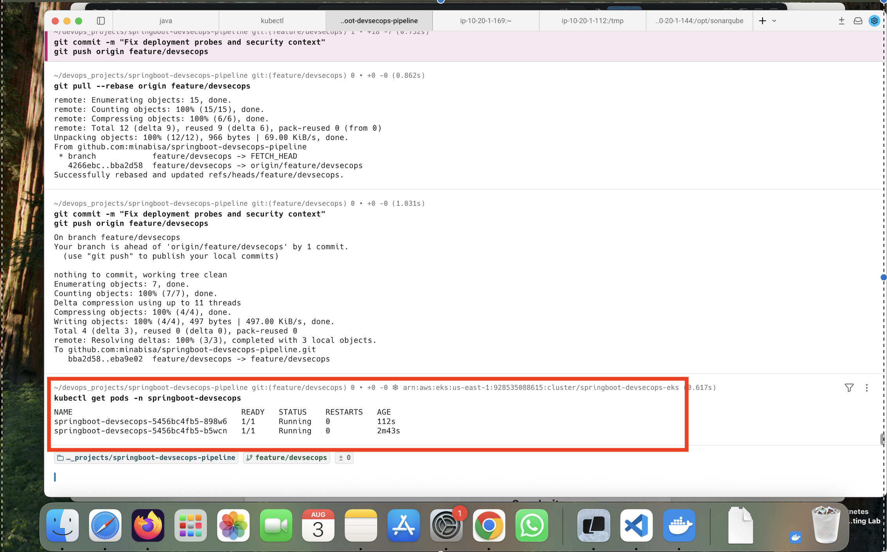
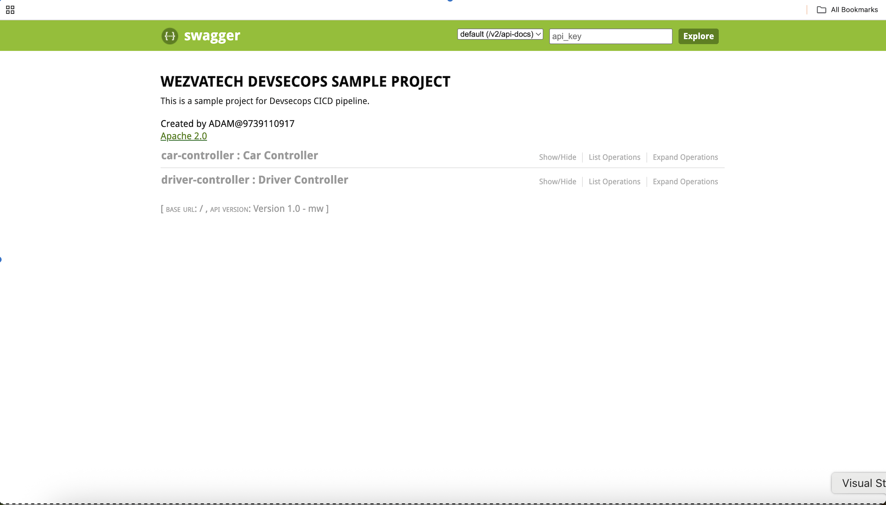

<div align="center">

# 🚀 Spring Boot DevSecOps GitOps Platform on Amazon EKS

### Secure CI/CD with Terraform, Jenkins, SonarQube, OWASP Dependency-Check, Trivy, Docker, Argo CD, and Amazon EKS

[](https://aws.amazon.com/eks/)
[](https://www.terraform.io/)
[](https://www.jenkins.io/)
[](https://www.docker.com/)
[](https://kubernetes.io/)
[](https://argo-cd.readthedocs.io/)
[](https://www.sonarsource.com/products/sonarqube/)
[](https://trivy.dev/)

**Designed and implemented by [Mina Bisa](https://github.com/minabisa)**

</div>

---

## Project Overview

This project implements an end-to-end **DevSecOps and GitOps delivery platform** for a Spring Boot application on AWS.

Terraform provisions the cloud infrastructure. GitHub webhooks trigger Jenkins, which builds and tests the application, publishes quality and security results, creates a versioned Docker image, scans it with Trivy, pushes it to Docker Hub, and updates the Kubernetes image tag in Git. Argo CD detects that Git change and synchronizes the desired state to Amazon EKS.

The result is a traceable deployment flow in which **security checks run before image publication**, **Git remains the deployment source of truth**, and **Kubernetes performs rolling application updates**.

---

## Architecture



### Delivery Flow

```text
Code Push
  → Jenkins Build Agent
  → Build, Tests, and Coverage
  → OWASP Dependency Scan
  → SonarQube Quality Gate
  → Docker Build
  → Trivy Scan
  → Docker Hub
  → GitOps Manifest Update
  → Argo CD Sync
  → Amazon EKS Rolling Deployment
```

---

## Business Problem

Manual delivery processes introduce inconsistent environments, weak auditability, delayed security feedback, and configuration drift.

This project addresses those problems by providing:

- Repeatable AWS infrastructure through Terraform
- Automated build and test execution
- Security checks integrated into CI
- Quality Gate enforcement before image publication
- Immutable image tags based on Jenkins build numbers
- GitOps-based Kubernetes delivery
- Automatic drift detection and reconciliation with Argo CD
- Secure non-root Kubernetes workloads with health probes and resource controls

---

## Technology Stack

| Area | Technology |
|---|---|
| Cloud | AWS |
| Infrastructure as Code | Terraform |
| CI Orchestration | Jenkins Controller |
| Build Execution | Dedicated Jenkins Agent |
| Application | Java, Spring Boot |
| Build Tool | Maven |
| Unit Test Coverage | JaCoCo |
| Static Analysis | SonarQube |
| Dependency Security | OWASP Dependency-Check |
| Containerization | Docker |
| Image Security | Trivy |
| Image Registry | Docker Hub |
| Orchestration | Kubernetes |
| Managed Kubernetes | Amazon EKS |
| Continuous Delivery | Argo CD |
| Source Control and GitOps | GitHub |
| Automation | Bash |

---

## Repository Structure

```text
springboot-devsecops-pipeline/
├── argocd/
│   └── application.yaml
├── docs/
│   └── images/
│       ├── application.png
│       ├── argocd.png
│       ├── dockerhub.png
│       ├── eks.png
│       ├── pipeline.png
│       ├── pods.png
│       ├── sonarqube.png
│       └── terraform.png
├── kubernetes/
│   ├── deployment.yaml
│   ├── namespace.yaml
│   └── service.yaml
├── scripts/
│   ├── install-agent.sh
│   ├── install-jenkins.sh
│   └── install-sonarqube.sh
├── src/
├── terraform/
│   ├── argocd.tf
│   ├── ec2.tf
│   ├── eks-iam.tf
│   ├── eks.tf
│   ├── helm.tf
│   ├── network.tf
│   ├── outputs.tf
│   ├── provider.tf
│   ├── security.tf
│   ├── variables.tf
│   └── versions.tf
├── .dockerignore
├── .gitignore
├── check.sh
├── Dockerfile
├── Jenkinsfile
├── pom.xml
└── README.md
```

---

## Infrastructure

Terraform provisions the infrastructure required by the platform:

- VPC networking and routing
- Security groups
- Jenkins Controller EC2 instance
- Jenkins Agent EC2 instance
- SonarQube EC2 instance
- EKS control plane and managed node group
- IAM roles and policy attachments
- Helm provider configuration
- Argo CD Helm release

> The repository currently uses public subnets for this portfolio lab. A production implementation should place worker nodes and internal services in private subnets and use controlled egress.

---

## Jenkins Pipeline

The Jenkins pipeline runs on the dedicated `build-agent`.

| Stage | Purpose |
|---|---|
| Tool Install | Makes configured Jenkins tools available to the agent |
| Checkout | Retrieves the selected Git branch |
| Build, Test and Coverage | Compiles the application, runs tests, and generates JaCoCo output |
| Verify Build Output | Confirms the compiled classes, test classes, coverage report, and JAR exist |
| SCA – OWASP Dependency Check | Scans third-party dependencies for known vulnerabilities |
| SAST – SonarQube Analysis | Performs static analysis and sends coverage/test data to SonarQube |
| Quality Gate | Stops delivery when the SonarQube Quality Gate fails |
| Build Docker Image | Creates versioned and `latest` images |
| Scan Docker Image | Produces Trivy table and JSON reports |
| Push Docker Image | Publishes the approved image to Docker Hub |
| Update GitOps Manifest | Updates `kubernetes/deployment.yaml` with the Jenkins build tag |
| Post Actions | Archives results and removes local images and workspace files |

### Image Versioning

Each successful build publishes an immutable image tag:

```text
minabisa90/springboot-devsecops:<BUILD_NUMBER>
```

Jenkins also updates the Kubernetes manifest to the same tag. This connects the CI artifact directly to the GitOps deployment revision.

---

## Security Controls

### Application and Dependency Security

- Maven unit tests
- JaCoCo code coverage
- SonarQube static analysis
- SonarQube Quality Gate enforcement
- OWASP Dependency-Check with an NVD API key
- Trivy container image vulnerability scanning

### Container Security

- Dedicated non-root user with numeric UID/GID `10001`
- Privilege escalation disabled
- Linux capabilities dropped
- Minimal Java runtime image
- Versioned and traceable container images

### Kubernetes Security and Reliability

- `runAsNonRoot`
- `RuntimeDefault` seccomp profile
- CPU and memory requests
- CPU and memory limits
- Startup probe
- Readiness probe
- Liveness probe
- Rolling update strategy
- Two application replicas

### Secrets Management

Jenkins credentials are used for:

- Docker Hub
- GitHub Personal Access Token
- SonarQube token
- NVD API key
- Jenkins Agent SSH key

No credentials should be committed to Git.

---

## GitOps Delivery

Jenkins does not deploy directly with `kubectl`.

After the image passes all pipeline checks:

1. Jenkins pushes the versioned image to Docker Hub.
2. Jenkins updates the image tag in `kubernetes/deployment.yaml`.
3. Jenkins commits the change using `[skip ci]` to avoid a webhook loop.
4. Argo CD detects the new Git revision.
5. Argo CD synchronizes the manifests to EKS.
6. Kubernetes performs a rolling update.
7. Argo CD reports the application as **Healthy** and **Synced**.

This separation keeps Jenkins responsible for CI and artifact publication, while Argo CD remains responsible for cluster delivery.

---

## Project Evidence

### Successful Jenkins Pipeline

All build, testing, security, image, and GitOps update stages completed successfully.

<p align="center">
  
</p>

### SonarQube Quality Gate

The application analysis passed its Quality Gate, with coverage and code-quality metrics published in SonarQube.

<p align="center">
  
</p>

### Versioned Images in Docker Hub

Jenkins published multiple versioned images and the `latest` tag.

<p align="center">
  
</p>

### Active Amazon EKS Cluster

The Terraform-provisioned EKS cluster is active.

<p align="center">
  
</p>

### Argo CD Healthy and Synced

Argo CD synchronized the Git revision and shows the Kubernetes resources as healthy.

<p align="center">
  
</p>

### Running Kubernetes Pods

Two application replicas are running with zero restarts.

<p align="center">
  
</p>

### Running Application

The deployed application exposes its API through Swagger UI.

<p align="center">
  
</p>

> `docs/images/terraform.png` contains public and private IP information. Redact the addresses before displaying that screenshot in a public README.

---

## Prerequisites

Before provisioning or running the platform, install and configure:

- AWS CLI
- Terraform
- Git
- `kubectl`
- An AWS account with permissions to create VPC, EC2, IAM, EKS, and related resources
- Docker Hub account
- GitHub Personal Access Token with repository content write permission
- NVD API key

---

## Provision the Infrastructure

```bash
git clone https://github.com/minabisa/springboot-devsecops-pipeline.git
cd springboot-devsecops-pipeline/terraform

terraform init
terraform fmt -check
terraform validate
terraform plan -out=tfplan
terraform apply tfplan
```

Review all resources before applying because EKS, EC2, EBS, and public IPv4 addresses can generate AWS charges.

---

## Configure `kubectl`

```bash
aws eks update-kubeconfig \
  --region us-east-1 \
  --name springboot-devsecops-eks

kubectl get nodes
```

---

## Access Argo CD

```bash
kubectl port-forward \
  service/argocd-server \
  8086:443 \
  --namespace argocd
```

Open:

```text
https://localhost:8086
```

Retrieve the initial admin password:

```bash
kubectl get secret argocd-initial-admin-secret \
  --namespace argocd \
  --output jsonpath='{.data.password}' \
  | base64 --decode

echo
```

---

## Verify the Deployment

```bash
kubectl get applications --namespace argocd

kubectl get deployment \
  --namespace springboot-devsecops

kubectl get pods \
  --namespace springboot-devsecops

kubectl get service \
  --namespace springboot-devsecops
```

Check the deployed image:

```bash
kubectl get deployment springboot-devsecops \
  --namespace springboot-devsecops \
  --output jsonpath='{.spec.template.spec.containers[0].image}'

echo
```

---

## Access the Application

The service is intentionally configured as `ClusterIP` to avoid a public LoadBalancer.

```bash
kubectl port-forward \
  service/springboot-devsecops \
  8080:8080 \
  --namespace springboot-devsecops
```

Open the Swagger UI:

```text
http://localhost:8080/swagger-ui.html
```

---

## Operational Notes

### Avoiding AWS Charges

An EKS control plane cannot be paused. Stop EC2 instances when they are not needed, but destroy the EKS resources when the lab is complete.

```bash
cd terraform
terraform destroy
```

Always confirm that EKS, node groups, EC2 instances, EBS volumes, public IPv4 addresses, and any other billable resources were removed.

### Do Not Commit Local Terraform Artifacts

The repository should not contain:

```text
terraform/tfplan
*.tfstate
*.tfstate.*
.terraform/
terraform.tfvars
```

Add these entries to `.gitignore` and remove any committed plan or state files.

---

## Key Results

- Automated infrastructure provisioning with Terraform
- Dedicated Jenkins Controller and build agent
- Automated unit testing and JaCoCo reporting
- Integrated SCA, SAST, and image scanning
- Quality Gate enforcement before image publication
- Immutable Docker image tags
- Automated GitOps manifest updates
- Argo CD auto-sync, pruning, and self-healing
- Rolling deployment to Amazon EKS
- Two healthy application replicas
- Secure non-root runtime configuration
- Reproducible installation scripts stored in Git

---

## Lessons Learned

This project required hands-on troubleshooting across several layers:

- Recovering Jenkins, agent, and SonarQube instances after EC2 replacement
- Managing Java 11 for the legacy Spring Boot build and Java 21 for modern scanner tooling
- Resolving OWASP NVD database memory pressure with swap and JVM limits
- Repairing SonarScanner runtime and permissions
- Configuring the SonarQube webhook for `waitForQualityGate`
- Preventing Jenkins webhook loops with `[skip ci]`
- Correcting non-root UID validation in Kubernetes
- Tuning startup, readiness, and liveness probes
- Separating CI responsibilities from GitOps deployment responsibilities

---

## Future Improvements

- Store Terraform state in S3 with DynamoDB state locking
- Move EKS worker nodes and internal services to private subnets
- Replace public EC2 administration endpoints with AWS Systems Manager
- Use Amazon ECR instead of Docker Hub
- Use AWS Secrets Manager with External Secrets Operator
- Add Helm or Kustomize overlays for dev, staging, and production
- Add Prometheus and Grafana monitoring
- Add centralized logging
- Enforce Kubernetes policies with Kyverno or OPA Gatekeeper
- Add SBOM generation and image signing with Syft and Cosign
- Add Slack or email pipeline notifications
- Introduce canary or blue/green deployment strategies

---

## Author

**Mina Bisa**

DevOps | Cloud | Kubernetes | AWS | Terraform | Jenkins | Docker | GitOps | DevSecOps

- GitHub: [github.com/minabisa](https://github.com/minabisa)
- Docker Hub: [hub.docker.com/u/minabisa90](https://hub.docker.com/u/minabisa90)

---

## Acknowledgment

The Spring Boot application source was adapted as a learning workload. The infrastructure, CI/CD pipeline, security integrations, container hardening, EKS deployment, GitOps workflow, installation scripts, and troubleshooting documented in this repository were implemented as part of this portfolio project.

---

## License

This repository currently does not include a license file. Add a `LICENSE` file before describing the project as MIT-licensed.
