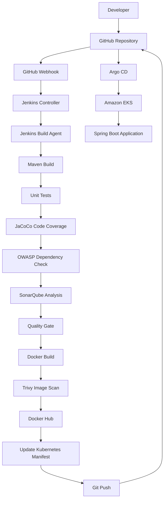

<p align="center">
  
</p>

<h1 align="center">
🚀 Enterprise DevSecOps GitOps Platform on Amazon EKS
</h1>

<h3 align="center">
Secure End-to-End CI/CD Pipeline using Terraform, Jenkins, SonarQube, OWASP Dependency Check, Trivy, Docker, Argo CD and Amazon EKS
</h3>

<p align="center">


</p>

---

# 📖 Project Overview

This project demonstrates the implementation of a complete **Enterprise DevSecOps platform** on **Amazon Web Services (AWS)** using modern CI/CD and GitOps practices.

The platform automates the entire software delivery lifecycle—from infrastructure provisioning and application build to security scanning, container image publishing, and Kubernetes deployment.

Infrastructure is provisioned using **Terraform**, continuous integration is handled by **Jenkins**, code quality and security are validated using **SonarQube**, **OWASP Dependency Check**, and **Trivy**, while **Argo CD** continuously deploys changes to **Amazon EKS** using GitOps principles.

The project focuses on implementing automation, security, scalability, and deployment consistency by following modern cloud-native engineering practices.

---

# 🎯 Project Objectives

- Provision cloud infrastructure using Infrastructure as Code (Terraform)
- Build a secure and automated CI/CD pipeline
- Integrate multiple DevSecOps security tools
- Enforce Quality Gates before deployment
- Build immutable Docker images
- Push container images to Docker Hub
- Implement GitOps Continuous Delivery using Argo CD
- Deploy workloads to Amazon EKS
- Follow Kubernetes security best practices
- Demonstrate an enterprise-ready deployment workflow suitable for production environments

---

# 💼 Business Problem

Many organizations still rely on manual deployment processes that introduce operational risk, security gaps, and inconsistent application delivery.

Common challenges include:

- Manual infrastructure provisioning
- Configuration drift across environments
- Limited security validation during CI/CD
- Inconsistent deployment processes
- Lack of automated vulnerability scanning
- Slow and error-prone software releases
- Limited deployment traceability

These challenges reduce deployment reliability and increase operational overhead.

---

# 💡 Solution

This project addresses these challenges by implementing a fully automated DevSecOps platform that integrates infrastructure provisioning, continuous integration, security scanning, containerization, and GitOps deployment into a single automated workflow.

Every code change automatically triggers a secure CI/CD pipeline that:

- Builds the application
- Executes automated testing
- Performs static code analysis
- Scans third-party dependencies
- Validates Quality Gates
- Builds and scans Docker images
- Pushes images to Docker Hub
- Updates Kubernetes deployment manifests
- Automatically deploys the application to Amazon EKS through Argo CD

This approach improves deployment consistency, reduces manual intervention, and enforces security throughout the software delivery lifecycle.

---

# ✨ Key Features

- Infrastructure as Code using Terraform
- Secure Jenkins CI/CD Pipeline
- Maven Build Automation
- Unit Testing
- JaCoCo Code Coverage
- SonarQube Static Code Analysis (SAST)
- OWASP Dependency Check (SCA)
- Trivy Container Image Scanning
- Docker Image Publishing
- GitOps Continuous Delivery
- Automated Kubernetes Deployment
- Amazon EKS
- Argo CD Synchronization
- Rolling Updates
- Non-Root Containers
- Kubernetes Security Contexts
- Resource Requests & Limits
- Health Probes
- Least Privilege Container Execution

---

# 📸 Project Showcase

## Architecture

<p align="center">

</p>

---

## Jenkins Pipeline

<p align="center">

</p>

---

## SonarQube Analysis

<p align="center">

</p>

---

## OWASP Dependency Check

<p align="center">

</p>

---

## Trivy Image Scan

<p align="center">

</p>

---

## Docker Hub

<p align="center">

</p>

---

## GitOps Deployment (Argo CD)

<p align="center">

</p>

---

## Amazon EKS

<p align="center">

</p>

---

## Running Application

<p align="center">

</p>

---

# 🏗 Solution Architecture

The platform follows a modern **GitOps-based DevSecOps architecture**, where infrastructure provisioning, continuous integration, security validation, container image management, and Kubernetes deployment are fully automated.

Every source code change triggers an end-to-end CI/CD workflow that validates application quality, performs multiple security scans, builds a secure Docker image, updates the Kubernetes deployment manifest, and allows Argo CD to synchronize the desired state with the Amazon EKS cluster.

---

# ☁ Enterprise Architecture



---

# 🔄 End-to-End CI/CD & GitOps Workflow

| Step | Description |
|------|-------------|
| 1 | Developer pushes application code to GitHub |
| 2 | GitHub Webhook automatically triggers Jenkins |
| 3 | Jenkins checks out the repository |
| 4 | Maven compiles the application |
| 5 | Unit tests are executed |
| 6 | JaCoCo generates code coverage reports |
| 7 | OWASP Dependency Check scans third-party dependencies |
| 8 | SonarQube performs Static Application Security Testing (SAST) |
| 9 | Jenkins waits for the SonarQube Quality Gate |
| 10 | Docker builds a production-ready image |
| 11 | Trivy scans the Docker image for vulnerabilities |
| 12 | Docker image is pushed to Docker Hub |
| 13 | Jenkins updates the Kubernetes deployment manifest |
| 14 | Jenkins commits the updated manifest to GitHub |
| 15 | Argo CD detects the Git change |
| 16 | Argo CD synchronizes Amazon EKS |
| 17 | Kubernetes performs a rolling deployment |
| 18 | The latest application version becomes available |

---

# 🛠 Technology Stack

| Category | Technology |
|------------|------------|
| Cloud Platform | Amazon Web Services (AWS) |
| Infrastructure as Code | Terraform |
| Continuous Integration | Jenkins |
| Continuous Delivery | Argo CD |
| Source Control | GitHub |
| Programming Language | Java |
| Framework | Spring Boot |
| Build Tool | Maven |
| Static Code Analysis | SonarQube |
| Software Composition Analysis | OWASP Dependency Check |
| Containerization | Docker |
| Image Security | Trivy |
| Container Registry | Docker Hub |
| Container Orchestration | Kubernetes |
| Managed Kubernetes | Amazon EKS |
| Operating System | Ubuntu Linux |
| Scripting | Bash |

---

# 📂 Repository Structure

```text
springboot-devsecops-pipeline/
│
├── argocd/
│   └── application.yaml
│
├── docs/
│   ├── images/
│   └── screenshots/
│
├── kubernetes/
│   ├── deployment.yaml
│   ├── namespace.yaml
│   └── service.yaml
│
├── scripts/
│   ├── install-agent.sh
│   ├── install-jenkins.sh
│   └── install-sonarqube.sh
│
├── terraform/
│   ├── provider.tf
│   ├── versions.tf
│   ├── variables.tf
│   ├── networking.tf
│   ├── security-groups.tf
│   ├── ec2.tf
│   ├── eks.tf
│   ├── iam.tf
│   ├── outputs.tf
│   └── terraform.tfvars.example
│
├── src/
│
├── Dockerfile
├── Jenkinsfile
├── pom.xml
├── README.md
├── .gitignore
└── LICENSE
```

---

# 🖥 Infrastructure Components

The platform consists of the following infrastructure components.

| Component | Purpose |
|-----------|---------|
| Jenkins Controller EC2 | Orchestrates the CI/CD pipeline |
| Jenkins Build Agent EC2 | Executes builds and security scans |
| SonarQube EC2 | Performs static code analysis |
| Docker Hub | Stores versioned Docker images |
| Amazon EKS | Hosts the Spring Boot application |
| GitHub | Source code and GitOps repository |
| Argo CD | Synchronizes Kubernetes manifests with Amazon EKS |

---

# 🔐 Security Architecture

Security is integrated throughout the CI/CD pipeline rather than being treated as a final deployment step.

The platform implements multiple layers of security including:

- Infrastructure as Code (Terraform)
- Static Application Security Testing (SonarQube)
- Software Composition Analysis (OWASP Dependency Check)
- Container Image Vulnerability Scanning (Trivy)
- Non-root Docker Containers
- Kubernetes Security Contexts
- Resource Requests and Limits
- Rolling Deployments
- GitOps Continuous Delivery
- Immutable Container Images

---

# 📊 CI/CD Pipeline Overview

```text
Developer
     │
     ▼
Git Push
     │
GitHub Webhook
     │
     ▼
Jenkins Controller
     │
     ▼
Jenkins Build Agent
     │
──────────────────────────────────────────────
Checkout Source Code
Compile Application
Unit Testing
JaCoCo Coverage
OWASP Dependency Check
SonarQube Analysis
Quality Gate Validation
Docker Image Build
Trivy Image Scan
Push Docker Image
──────────────────────────────────────────────
     │
Update Kubernetes Deployment
     │
Git Commit
     ▼
GitHub Repository
     │
Argo CD
     │
Amazon EKS
     │
Rolling Deployment
     │
Spring Boot Application
```

---

# ☁ Infrastructure Provisioning

The entire AWS infrastructure is provisioned using **Terraform**, enabling repeatable, version-controlled, and automated deployments.

Terraform creates the networking, compute resources, security groups, IAM roles, and Amazon EKS cluster required to support the complete DevSecOps platform.

## Infrastructure Components

| Resource | Description |
|----------|-------------|
| VPC | Dedicated virtual network for the platform |
| Public Subnets | Internet-facing resources |
| Private Subnets | Secure Kubernetes worker nodes |
| Internet Gateway | Public internet connectivity |
| Route Tables | Network routing |
| Security Groups | Access control for EC2 and EKS |
| IAM Roles | Least-privilege permissions |
| Jenkins Controller EC2 | CI/CD orchestration server |
| Jenkins Build Agent EC2 | Executes builds and security scans |
| SonarQube EC2 | Static code analysis server |
| Amazon EKS | Managed Kubernetes cluster |

---

# 🧱 Infrastructure as Code

Terraform provides several benefits:

- Fully automated infrastructure provisioning
- Version-controlled infrastructure
- Repeatable deployments
- Consistent environments
- Reduced manual configuration
- Easy disaster recovery
- Simplified infrastructure maintenance

---

# ⚙ Continuous Integration Pipeline

Every code change automatically triggers a secure CI pipeline through a GitHub Webhook.

The pipeline executes multiple validation stages before any deployment occurs.

```text
Git Push
      │
      ▼
GitHub Webhook
      │
      ▼
Jenkins Controller
      │
      ▼
Jenkins Build Agent
```

---

# 🚀 Jenkins Pipeline Stages

## 1️⃣ Source Code Checkout

The pipeline retrieves the latest source code from GitHub.

### Purpose

- Clone repository
- Ensure latest commit is used
- Initialize workspace

---

## 2️⃣ Build

The application is compiled using Maven.

```bash
mvn clean package
```

### Output

- Executable Spring Boot JAR
- Build artifacts

---

## 3️⃣ Unit Testing

Automated tests validate application functionality.

### Benefits

- Detect regressions
- Verify business logic
- Increase deployment confidence

---

## 4️⃣ Code Coverage (JaCoCo)

JaCoCo measures how much application code is exercised by automated tests.

### Benefits

- Identify untested code
- Improve test quality
- Increase software reliability

---

## 5️⃣ Software Composition Analysis (OWASP Dependency Check)

OWASP Dependency Check scans third-party libraries for publicly known vulnerabilities (CVEs).

### Benefits

- Detect vulnerable dependencies
- Reduce supply-chain risk
- Improve application security

---

## 6️⃣ Static Application Security Testing (SonarQube)

SonarQube analyzes source code without executing the application.

It identifies:

- Bugs
- Code smells
- Security hotspots
- Vulnerabilities
- Duplicated code
- Maintainability issues

---

## 7️⃣ Quality Gate

The pipeline waits for the SonarQube Quality Gate result before continuing.

If the Quality Gate fails:

- Docker image is **not** built.
- Application is **not** deployed.

This prevents low-quality code from reaching production.

---

## 8️⃣ Docker Image Build

A production-ready Docker image is created.

Security best practices include:

- Multi-stage build
- Small runtime image
- Non-root user
- Minimal attack surface
- Immutable container

---

## 9️⃣ Container Image Scanning (Trivy)

Trivy scans the Docker image for:

- Operating system vulnerabilities
- Application library vulnerabilities
- Misconfigurations
- Known CVEs

Only validated images proceed through the deployment workflow.

---

## 🔟 Publish Docker Image

After successful validation:

- Image is tagged using the Jenkins build number.
- Image is pushed to Docker Hub.

Example:

```text
minabisa90/springboot-devsecops:15
```

Each build produces an immutable image version, enabling rollback if necessary.

---

# 🔄 GitOps Deployment Workflow

Instead of deploying directly from Jenkins, the platform follows GitOps principles.

After pushing the Docker image:

1. Jenkins updates the Kubernetes deployment manifest.
2. Jenkins commits the updated image tag to GitHub.
3. Argo CD detects the Git change.
4. Argo CD synchronizes Amazon EKS.
5. Kubernetes performs a rolling update.

This ensures Git remains the single source of truth.

---

# ☸ Kubernetes Deployment

The application is deployed to Amazon EKS using Kubernetes manifests.

Deployment features include:

- Rolling updates
- Replica management
- Health probes
- Resource requests
- Resource limits
- High availability

---

# 🔐 Kubernetes Security Best Practices

The deployment follows multiple security recommendations.

## Pod Security

- Run as non-root user
- RuntimeDefault seccomp profile
- Linux capabilities dropped
- Privilege escalation disabled

## Resource Management

- CPU requests
- CPU limits
- Memory requests
- Memory limits

## Health Monitoring

- Startup Probe
- Readiness Probe
- Liveness Probe

These probes ensure traffic is routed only to healthy application instances.

---

# 🚀 GitOps with Argo CD

Argo CD continuously monitors the Git repository.

Whenever Jenkins commits a new image tag:

```text
Docker Image

↓

Update deployment.yaml

↓

Git Push

↓

Argo CD detects change

↓

Sync Amazon EKS

↓

Rolling Deployment

↓

Application Updated
```

Advantages include:

- Declarative deployments
- Automatic synchronization
- Self-healing
- Drift detection
- Easy rollback
- Complete deployment history

---

# 📈 Project Outcomes

This implementation demonstrates:

- Automated infrastructure provisioning
- Secure CI/CD pipeline
- Continuous security validation
- Immutable container deployments
- GitOps-based application delivery
- Kubernetes deployment automation
- Enterprise security best practices
- Production-oriented cloud architecture

---

# 🎯 Skills Demonstrated

## Cloud

- Amazon Web Services
- Amazon EC2
- Amazon EKS
- IAM
- VPC

## Infrastructure

- Terraform
- Infrastructure as Code

## CI/CD

- Jenkins
- GitHub Webhooks
- GitOps
- Argo CD

## Containers

- Docker
- Docker Hub
- Kubernetes

## DevSecOps

- SonarQube
- OWASP Dependency Check
- Trivy

## Development

- Java
- Spring Boot
- Maven

## Linux

- Ubuntu
- Bash Scripting
